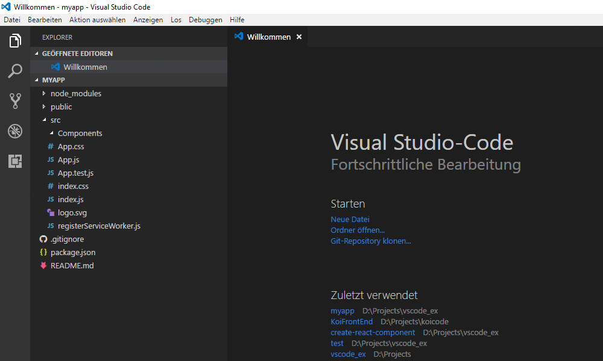

# create-react-component README

## Features

Adds a "Add React Component" to context menue of folders

## Contact

If you run into any issues, please file an issue on [GitHub](https://github.com/tobi12345/create-react-component).